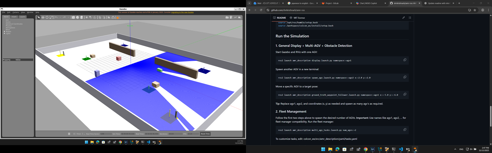
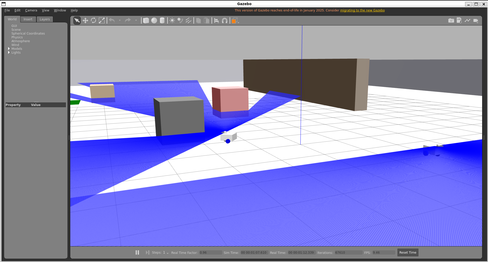
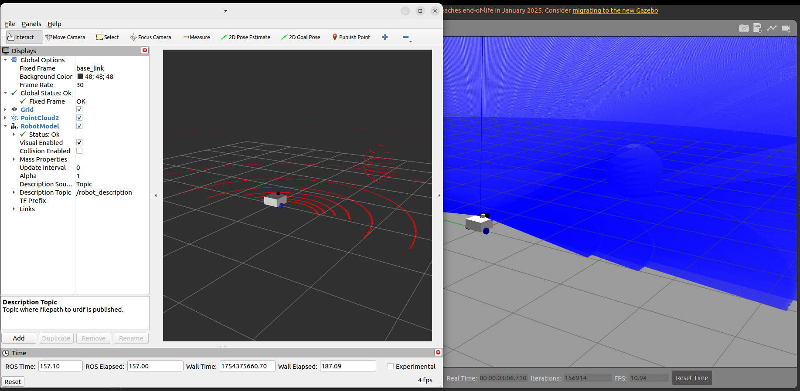

# AMR-ROS: Multi-AGV Simulation with ROS 2, Gazebo, and Fleet Management

This project provides a **complete simulation framework** for **Autonomous Mobile Robots (AMRs)** using **ROS 2 Humble** and **Gazebo Classic**, featuring **multi-AGV orchestration**, **fleet management**, **battery monitoring**, and **dynamic task allocation**.

---

## Features

- **Multi-AGV Simulation** in Gazebo with ROS 2 namespaces
- **Fleet Manager** for:
  - Dynamic **task allocation** (pickup → drop-off)
  - **Battery monitoring** and **automatic charging**
- **Waypoint Navigation** using ground-truth odometry
- **Obstacle detection & smooth stop** using LiDAR
- **Charging station docking monitor**
- **Configurable launch system** for spawning multiple AGVs and loading tasks from YAML
- **Dockerized environment** for reproducibility and easy setup

---

## Tech Stack

| Tool/Tech         | Purpose                                  |
|-------------------|------------------------------------------|
| **ROS 2 Humble**  | Robot middleware                        |
| **Gazebo Classic**| 3D simulation environment               |
| **Python**        | ROS 2 nodes (fleet manager, controllers)|
| **Docker**        | Containerization for portability        |
| **RViz2**         | Visualization                           |

---

## Background
- Real-world AMR fleets require scalable orchestration to manage multiple robots in dynamic warehouse environments.
- This project simulates such an ecosystem, focusing on autonomous task scheduling, obstacle avoidance, and charging logic — all crucial aspects of real-world fleet control systems.

---

## Directory Structure

```
amr-ros/
├── docker/                     # Dockerfile and setup scripts for containerized environment
│
├── colcon_ws/                  # ROS 2 workspace
│   └── src/
│       └── amr_description/    # Main AMR (Autonomous Mobile Robot) package
│           ├── amr_description/   # Python source code
│           ├── launch/            # Launch files for navigation, SLAM, fleet manager, etc.
│           ├── maps/              # Map files for simulation or localization
│           ├── resource/          # URDFs, meshes, and robot resources
│           ├── test/              # Unit and integration tests
│           ├── urdf/              # Robot model definitions (URDF/Xacro)
│           ├── worlds/            # Gazebo world files
│           └── yaml/              # Configuration and parameter YAMLs
│
├── docs/                        # Documentation, design notes, diagrams
│
├── media/                       # Screenshots, simulation captures, videos
│
└── README.md                    # Project overview and setup guide
```

---

## Core Components
- **ground_truth_waypoint_follower.py**  
  Executes dynamic goals (`/<ns>/goal_pose`) → publishes `cmd_vel` with obstacle-aware smooth stopping.
- **obstacle_detection_node.py**  
  Monitors LiDAR scan → publishes `/<ns>/obstacle_detected`.
- **fleet_manager.py**  
  Assigns tasks from `tasks.yaml`, monitors battery, sends goals to AGVs.
- **charger_dock_monitor.py**  
  Detects proximity to charging stations → publishes `/<ns>/on_charger`.

---

## Installation & Setup

### 1. Clone the Repository
```bash
git clone https://github.com/shrikrishnarb/amr-ros.git
cd amr-ros
```

### 2. Build Docker Image
From the docker/ directory:
```bash
docker build -t amr-ros-dev -f docker/Dockerfile .
```

### 3. Run the Container
**Prerequisite for GUI (Gazebo, RViz):**
Ensure `xhost` is installed on your host:
```bash
sudo apt-get install x11-xserver-utils
```
Enable X11 for GUI (Gazebo, RViz):
```bash
# Allow X11 for GUI apps (Gazebo, RViz)
xhost +local:root

# Build and start the container
cd docker
docker compose up --build -d

# Start the container
docker exec -it amr-ros-dev bash  # For gpu use (docker exec amr-ros-dev-gpu bash)
```
For stopping the container:
```bash
docker compose down
```

### 4. Inside the Container
```bash
cd /workspace/colcon_ws
colcon build --symlink-install
source /opt/ros/humble/setup.bash
source /workspace/colcon_ws/install/setup.bash
```

## Run the Simulation

### **1. General Display + Multi-AGV + Obstacle Detection**
Start Gazebo and RViz with one AGV:
```bash
ros2 launch amr_description display.launch.py namespace:=agv1
```
Spawn another AGV in a new terminal:
```bash
ros2 launch amr_description spawn_agv.launch.py namespace:=agv2 x:=2.0 y:=2.0
```
Move a specific AGV to a target pose:
```bash
ros2 launch amr_description ground_truth_waypoint_follower.launch.py namespace:=agv1 x:=-5.0 y:=-6.0
```
**Tip:** Replace agv1, agv2, and coordinates (x, y) as needed and spawn as many agv's as required.

### **2. Fleet Management**
Follow the first two steps above to spawn the desired number of AGVs.
**Important:** Use names like agv1, agv2, … for fleet manager compatibility.
Run the fleet manager:
```bash
ros2 launch amr_description multi_agv_tasks.launch.py num_agvs:=2
```
To customize tasks, edit:
colcon_ws/src/amr_description/yaml/tasks.yaml

### **3. Slam and Navigation**
Basic SLAM:
```bash
ros2 launch amr_description slam.launch.py
```
Basic Navigation:
```bash
ros2 launch amr_description navigation.launch.py
```
**Note:** Navigation features are not integrated with fleet management yet; these are standalone demos.

---

## Demo & Screenshots
Below are some visuals from the project setup and simulation.

### Gazebo World


### Multiple AGV's spawned


### 3D Lidar


---

## AI Usage
AI tools were used to refine the README’s clarity and to assist in structuring launch files and FSM transitions.  
All core logic (fleet coordination, waypoint navigation, and obstacle handling) was implemented manually.

---
