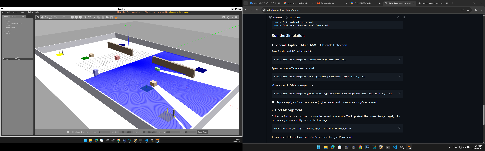
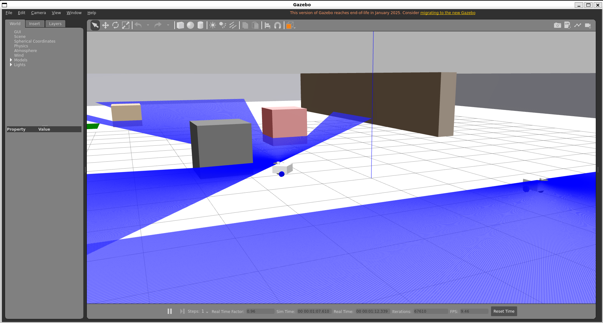
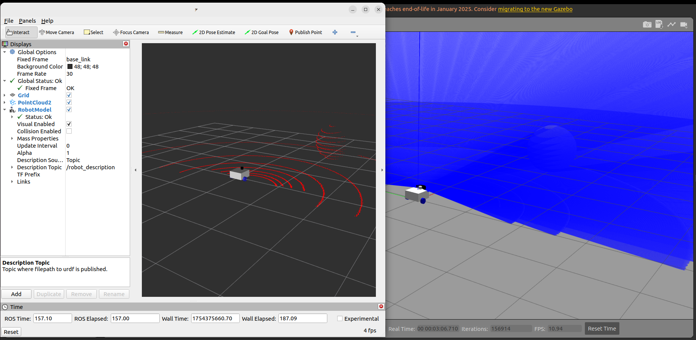

# AMR-ROS: Multi-AGV Fleet Simulation with ROS 2, Nav2, and Gazebo

A complete simulation framework for **Autonomous Mobile Robots (AMRs)** built with **ROS 2 Humble** and **Gazebo Classic**. Robots navigate using a full Nav2 stack (AMCL localisation + NavFn global planner + DWB local planner), avoid each other as dynamic obstacles in real time, and are orchestrated by a fleet manager that assigns pickup→dropoff tasks and monitors battery.

---

## Features

- **Full Nav2 autonomous navigation** — AMCL localisation on a pre-built map, NavFn global path planning, DWB local planner
- **Continuous global replanning** — global path recomputed every 2 seconds so robots reroute smoothly around dynamic obstacles (including each other)
- **Multi-AGV fleet management** — greedy task assignment, battery monitoring, automatic charging
- **Multi-robot namespacing** — spawn any number of AGVs with isolated TF trees and topic namespaces
- **SLAM mapping** — build a new map of any world with SLAM Toolbox
- **Dockerised environment** — one command to get a fully working ROS 2 + Gazebo setup

---

## Tech Stack

| Tool | Purpose |
|---|---|
| ROS 2 Humble | Robot middleware |
| Gazebo Classic | 3D physics simulation |
| Nav2 | Autonomous navigation stack (AMCL, NavFn, DWB) |
| SLAM Toolbox | Map building |
| Python | All ROS nodes |
| Docker | Reproducible, dependency-free setup |

---

## Directory Structure

```
amr-ros/
├── docker/                         # Dockerfile + compose file
├── colcon_ws/
│   └── src/
│       └── amr_description/        # Main package
│           ├── amr_description/    # Python nodes
│           │   ├── fleet_manager.py
│           │   ├── nav2_goal_bridge.py
│           │   ├── tf_relay.py
│           │   ├── odom_sim_filter.py
│           │   ├── obstacle_detection_node.py
│           │   ├── battery_sim.py
│           │   ├── charger_dock_monitor.py
│           │   └── ground_truth_waypoint_follower.py
│           ├── behavior_trees/     # Nav2 behaviour tree XML
│           ├── launch/             # Launch files
│           ├── maps/               # Pre-built map (pgm + yaml)
│           ├── urdf/               # Robot model (Xacro)
│           ├── worlds/             # Gazebo world
│           └── yaml/               # tasks.yaml, nav2_params_amr.yaml
├── docs/                           # Architecture notes
├── media/                          # Screenshots
├── CHANGELOG.md                    # Full project evolution (v1 → current)
└── README.md
```

---

## Key Nodes

| Node | Role |
|---|---|
| `fleet_manager.py` | Assigns pickup→dropoff tasks from `tasks.yaml`, monitors battery, sends robots to chargers. Re-sends active goal every 10 s to survive Nav2 startup delay. |
| `nav2_goal_bridge.py` | Bridges `/<ns>/goal_pose` to Nav2's `navigate_to_pose` action. Buffers goals until Nav2 is active, ignores re-sends for the same destination. |
| `tf_relay.py` | Relays global `/tf` → `/<ns>/tf` (required because Nav2 with namespacing reads from namespaced TF topics). |
| `odom_sim_filter.py` | Converts Gazebo ground-truth odometry into `odom→base_footprint` TF for each robot. |
| `battery_sim.py` | Simulates battery drain/charge; publishes `/<ns>/battery_state`. |
| `charger_dock_monitor.py` | Detects proximity to charger zones; publishes `/<ns>/on_charger`. |
| `obstacle_detection_node.py` | Reads LiDAR scan; publishes `/<ns>/obstacle_detected`. |
| `ground_truth_waypoint_follower.py` | Simple straight-line follower using ground-truth pose (useful for quick testing without Nav2). |

### Fleet Manager FSM (per robot)

```
IDLE → TO_PICKUP → LOADING → TO_DROPOFF → UNLOADING → IDLE
                                    ↑
         (battery low) → TO_CHARGER → CHARGING → IDLE
```

---

## Installation & Setup

### 1. Clone

```bash
git clone https://github.com/shrikrishnarb/amr-ros.git
cd amr-ros
```

### 2. Enable Gazebo GUI (required for Gazebo window on host display)

Run this on your HOST machine (not inside the container) before starting Docker:

```bash
sudo apt-get install x11-xserver-utils   # host only — skip if already installed
xhost +local:root
```

This allows the Docker container to open GUI windows on your display.
You need to run this once per host session (after each reboot or logout).

**VirtualBox users:** If Gazebo crashes or shows a black screen,
enable software rendering by adding this to your shell before
running docker compose:

```bash
export LIBGL_ALWAYS_SOFTWARE=1
```

Or run Gazebo with software rendering explicitly:

```bash
LIBGL_ALWAYS_SOFTWARE=1 ros2 launch amr_description display.launch.py namespace:=agv1
```

This is already set inside the Docker container automatically.
The export is only needed if you run ROS2 directly on the host.

### 3. Build and start the container

```bash
cd docker
docker compose up --build -d
docker exec -it amr-ros-dev bash
```

### 4. Build the workspace (inside the container)

```bash
cd /workspace/colcon_ws
colcon build --symlink-install
source /opt/ros/humble/setup.bash
source /workspace/colcon_ws/install/setup.bash
```

> After editing Python nodes, a rebuild is not needed (symlink install). Rebuild only when `setup.py` changes (new entry points or data files).

---

## Troubleshooting Common Errors

**gzclient crashes with exit code -6**
This is a graphics driver issue in VirtualBox. The simulation still
runs on gzserver — only the GUI window fails. To fix:
```bash
xhost +local:root          # run on host before starting Docker
```
If it still crashes, software rendering is already enabled inside
the container via `LIBGL_ALWAYS_SOFTWARE=1`. Restart the container:
```bash
docker compose down && docker compose up -d
```

**odom_sim_filter crashes with NumPy AttributeError**
This is a NumPy version incompatibility with the system transforms3d
package. It is fixed automatically in the Docker image build. If you
see this error it means you are not using the Docker environment.
Always run everything inside the container:
```bash
docker exec -it amr-ros-dev bash
```

**Authorization required, but no authorization protocol specified**
Run on your host machine before starting Docker:
```bash
xhost +local:root
```

**No module named ultralytics**
ultralytics is pre-installed in the Docker image. If you see this
error the image was built from an older version before this fix.
Rebuild the image:
```bash
docker compose down
docker compose build --no-cache
docker compose up -d
```

---

## Running the Simulation

### Fleet Management — Standalone (recommended)

Launches Gazebo, spawns robots, starts Nav2 per robot, and runs the fleet manager — all in one command:

```bash
ros2 launch amr_description amr_fleet_management.launch.py \
    num_agvs:=2 \
    launch_gazebo:=true \
    spawn_poses:="0.0,0.0;2.0,2.0"
```

Robots automatically navigate to their assigned pickup and dropoff zones, rerouting around each other as dynamic obstacles.

To customise tasks and zones, edit:
```
colcon_ws/src/amr_description/yaml/tasks.yaml
```

### Fleet Management — Fleet-only mode (Gazebo already running)

If you have already started Gazebo and spawned robots separately:

```bash
# Terminal 1 — Gazebo + AGV 1
ros2 launch amr_description display.launch.py namespace:=agv1

# Terminal 2 — Spawn AGV 2
ros2 launch amr_description spawn_agv.launch.py namespace:=agv2 x:=2.0 y:=2.0

# Terminal 3 — Nav2 + fleet manager (no Gazebo)
ros2 launch amr_description amr_fleet_management.launch.py \
    num_agvs:=2 \
    spawn_poses:="0.0,0.0;2.0,2.0"
```

### Single Robot Display

```bash
ros2 launch amr_description display.launch.py namespace:=agv1
```

### Send a Robot to a Pose (no Nav2)

```bash
ros2 launch amr_description ground_truth_waypoint_follower.launch.py \
    namespace:=agv1 x:=-5.0 y:=-6.0
```

### SLAM — Build a New Map

```bash
ros2 launch amr_description mapping.launch.py
```

Drive the robot with the teleop keyboard window. When the map looks good, save it:

```bash
ros2 run nav2_map_server map_saver_cli \
    -f /workspace/colcon_ws/src/amr_description/maps/my_map
```

Then rebuild so the map is installed:

```bash
cd /workspace/colcon_ws
colcon build --symlink-install --packages-select amr_description
```

---

## Tests

```bash
cd /workspace/colcon_ws
colcon test --packages-select amr_description
colcon test-result --verbose
```

---

## Demo & Screenshots

### Gazebo World


### Multiple AGVs Spawned


### LiDAR Visualisation


---

## AI / Perception Layer

The `amr_vision` package extends the base AMR fleet with a dual-perception stack: the
existing LiDAR pipeline (from `amr_description`) handles low-level safety, while a
YOLO-based camera node adds semantic awareness — enabling the fleet to respond
differently based on *what* is detected, not just *that* something is there.

### Architecture

```
Camera (Gazebo sensor)    │
          ▼
camera_detection_node ──► /{ns}/camera/detections (full JSON)
(YOLOv8n, 5Hz)        ──► /{ns}/camera/obstacle_semantic (clear/person/pallet)
          │
          ▼
fleet_manager_ai (semantic-conditional FSM)
```

### Semantic Decision Table

| Detected Class | Fleet Response |
|---|---|
| `person` | Cancel Nav2 goal, stop in place, wait for clear signal |
| `pallet` | Reduce speed to 0.1 m/s, allow Nav2 dynamic costmap to reroute |
| `clear` | Resume normal speed and navigation goal |

### Launching the AI Fleet

```bash
ros2 launch amr_vision amr_vision_fleet.launch.py \
    num_agvs:=2 \
    launch_gazebo:=true \
    spawn_poses:="0.0,0.0;2.0,2.0"
```

### Notes on the Model

YOLOv8n (COCO pretrained) is used in simulation. COCO class `person` maps directly;
`suitcase` is used as a pallet proxy for simulation purposes. A production deployment
would use a domain-specific model fine-tuned on warehouse objects, exported to ONNX
and optimized with TensorRT for edge hardware with the same pipeline used in the
[edge-vision-inspector](https://github.com/shrikrishnarb/edge-vision-inspector) project and validated on
NVIDIA Jetson Orin AGX.

---

## Project Evolution

See [CHANGELOG.md](CHANGELOG.md) for the full story of how this project grew from a keyboard-controlled robot to an autonomous multi-robot fleet including every major feature added and the problems solved along the way.
